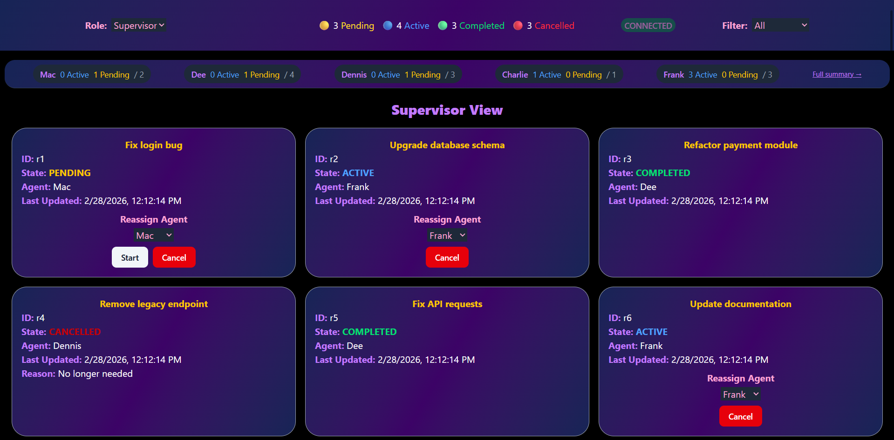

# Submission Documentation

**Frontend Developer Intern — Technical Assignment**

---

## 1. App Overview

> 

> 

The app loads as a real-time operations dashboard showing all active service requests in a responsive card grid. The header displays the current role (Supervisor by default), a live connection indicator, request counts for each state, and a filter dropdown. Below the header, a per-agent summary bar shows each agent's active, pending and total workload.

Live updates are powered by a simulated event stream ('useRequestStream') that fires every 5 seconds randomly doing of three tasks:

- Creating new requests
- Advancing a random existing request's states from PENDING → ACTIVE → or from ACTIVE -> COMPLETED
- Assigning agents to requests with no assigned agents. The stream disconnects every 30 seconds and reconnects after 5 in a loop.

---

## 2. Task 1 — Request Dashboard

### Screenshot A: Mixed Request States

> 

The dashboard displays all requests as cards in a responsive grid (1 column on mobile, 2 on tablet, 3 on desktop). Each card shows the request description, ID, current state, assigned agent, and last updated timestamp. State is color-coded: yellow for PENDING, blue for ACTIVE, green for COMPLETED, and red for CANCELLED.

I chose bold color-coded text over badges or icons because it keeps the card compact while still making the states stand out across the whole grid.

### Screenshot B: Filtered to a Single State

> 

The filter dropdown in the header immediately narrows the grid to only requests matching the selected state. Here, filtering to ACTIVE shows only in-progress requests. The filter is stored in the global reducer state so it persists across role switches. When no requests match the filter, a clear empty-state message is shown instead of a blank grid.

---

## 3. Task 2 — Role Views

### Screenshot A: Supervisor View

> 

Supervisors see every request in the system regardless of assignment. The agent summary bar below the header provides a quick per-agent breakdown (active/pending/total) — clicking any agent pill or the "Full summary →" link opens a detailed modal showing all 4 state counts per agent. From this view, supervisors can reassign agents via a dropdown on each card, start pending requests that have an assigned agent, or cancel any request that has not been completed yet. The summary bar is hidden entirely for agents since they only need their own workload.

### Screenshot B: Agent View

> 

Switching to Agent view filters the list to only requests assigned to the current agent (hardcoded as "Dee" / 'a2'). Agents see a "Start" button on their PENDING requests and a "Mark Complete" button on ACTIVE ones and they cannot reassign or cancel their own requests. The view title changes to "Agent View" in blue (vs. purple for Supervisor) and clicking it toggles between roles. This role-based filtering is handled in 'RequestList' itself rather than the reducer.

### Screenshot C: Cancel Flow

> 

When a Supervisor clicks "Cancel" on a request, a modal overlay appears with a backdrop blur. The user must type "CONFIRM" exactly before the cancel button enables which prevents accidental cancellations. An optional textarea lets the supervisor provide a reason, which is stored on the request and displayed on the card after cancellation.

---

## 4. One Decision I'm Proud Of

**Using a 'ref' to decouple the event stream from request state changes.**

The 'useRequestStream' hook needs access to the latest 'state.requests' to pick a random request for state transitions. At first, I included 'state.requests' in the 'useEffect' dependency array. But this causes the entire effect to restart every time any request changes, and since that happens every 5 seconds from the request stream itself, this restart clears the disconnect timer, so the 30-second disconnect cycle can never fire and the disconnection didn't work.

The fix was to store 'state.requests' in a 'useRef' that updates via a separate lightweight 'useEffect', and read from the ref inside the interval callback. This lets the stream effect run once and stay stable, while always having access to the latest data and the loop can continue causing the intended actions.

---

## 5. One Thing I'd Improve

The agent identity is hardcoded as 'currentAgentId' = 'a2' directly in 'RequestList'. In a real app, this would come from an authentication context, and switching to Agent view would show requests for the user who is logged in. Beyond that, the request list keeps growing as the request stream creates new requests and with enough time running, this would degrade performance significantly. I'd add virtualized rendering with 'react-window'. The Modal accessibility can also be made better by using Radix 'Dialog' primitives.

---

## 6. Bonus Task — WebSocket Simulation

> 

The 'useRequestStream' hook simulates a full connection lifecycle. It starts a 'setInterval' that dispatches random events every 5 seconds ('REQUEST_CREATED', 'STATE_CHANGED', or 'AGENT_ASSIGNED'). After 30 seconds, it clears the interval, sets status to 'RECONNECTING', and waits 5 seconds before recursively calling 'startStream()' to restart the cycle. The connection status is displayed as a pill in the header: green with a pulse animation when connected, yellow when reconnecting.

The hook returns a simple 'CONNECTED' | 'RECONNECTING' status string. The key was using 'useRef' for the latest requests to avoid restarting the effect before the 30 second timer fires.
